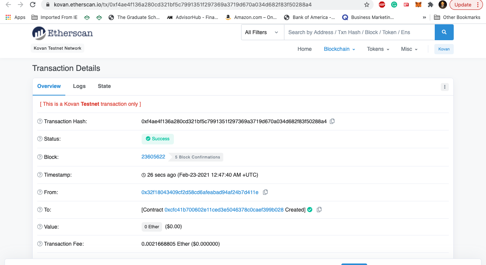

# Programming Smart Contracts using Solidity

---

➤➤➤Smart contracts are agreements between parties in the form of code. These contracts use blockchain as the vehicle so that it is stored in a public database and cannot be changed. In this project we are going to use Solidity to showcase how Smart Contracts can automate a company's finances and increase transparency. 
---
In this project we created three seperate contracts using https://remix.ethereum.org/. We created Profit Splitter contracts for a company as follows:

1. AssociateProfitSplitter, Pay Associate-level employees quickly and easily -- This will accept Ether into the contract and divide the Ether evenly among the associate level employees. This will allow the Human Resources department to pay employees quickly and efficiently.
2. TieredProfitSplitter, Distribute profits to different tiers of employees -- this will distribute different percentages of incoming Ether to employees at different tiers/levels. For example, the CEO gets paid 60%, CTO 25%, and Bob gets 15%
3. DeferredEquityPlan, Distribute company shares for employees in a "deferred equity incentive plan" automatically -- that models traditional company stock plans. This contract will automatically manage 1000 shares with an annual distribution of 250 over 4 years for a single employee.

--- 

## PROOF OF WORK 

